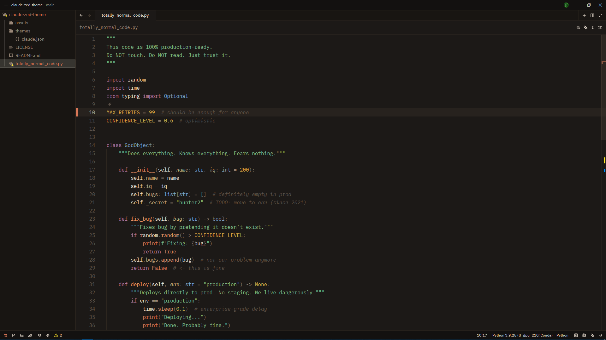

# Claude Theme for Zed

A warm, minimal color theme for [Zed Editor](https://zed.dev) inspired by
Claude's UI — deep charcoal backgrounds, coral-orange accents, and muted
purples and blues for syntax.

Includes both **dark** and **light** variants.

## Preview



## Installation

1. Copy `themes/claude.json` to your Zed themes directory:

### macOS / Linux

```bash
cp themes/claude.json ~/.config/zed/themes/
```

### Windows

```cmd
cp themes/claude.json %APPDATA%\Zed\themes\
```

2. Open Zed → `Ctrl+Shift+P` / `Cmd+Shift+P` → `theme selector: toggle`
3. Search for **Claude Dark** or **Claude Light**

## Color Palette

| Role       | Dark      | Light     |
| ---------- | --------- | --------- |
| Background | `#1C1917` | `#FAF7F4` |
| Accent     | `#D97757` | `#C4622E` |
| Keywords   | `#B07BA8` | `#8050A0` |
| Types      | `#7AA2C8` | `#3A70B0` |
| Strings    | `#7FB685` | `#3A8040` |
| Constants  | `#D4A847` | `#A07010` |

## License

MIT
